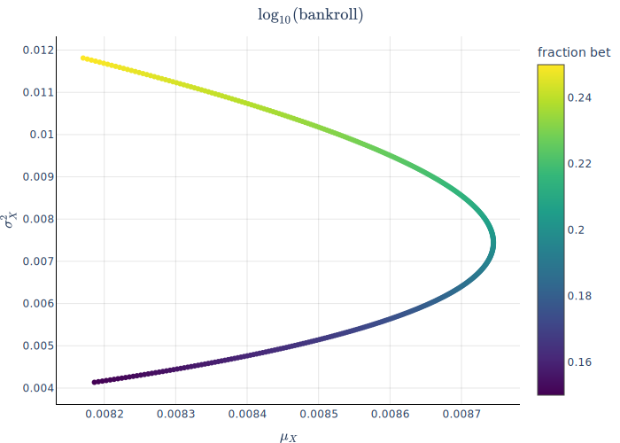

# Kelly's criterion: placing optimal bets

The [Kelly criterion](https://en.wikipedia.org/wiki/Kelly_criterion) is meant to
tell you how to make best use of useful-but-imperfect information. For example,
suppose you're able to place even-odds bets on the outcome of a coin flip. If
you're right, you double the money you bet, and if you're wrong, you lose what
you bet. To make things interesting, you know that it's _not a fair coin_; it
comes up heads with probability $p = 0.6$. You're going to get to play $100$
times. How should you place bets?

Well, suppose you start with bankroll $B$ and you bet some fraction $f$ each
round. The $fB$ you bet doubles  with probability $p$ and disappears with
probability $1-p$, and the $(1-f)B$ you didn't bet just sits there. So you end
up with $(1 + f)B$ with probability $p$ and $(1 - f)B$ with probability $(p-1)$.
The expected value is 

$$
p(1+f)B + (1-p)(1-f)B = (1 + 2pf - f)B
$$

Since $2p - 1 = 0.2 > 0$, the bigger you can make $f$, the larger this expected value.
So you should bet as much as you possibly can! Let's say you're not allowed to
take out a loan, so the most you can bet is everything, $f=1.0$.

## That's not right ...

Yes, it is. After $100$ rounds, you'll almost certainly have lost all your
money, but in the rare case that you haven't ($p^{100} \approx 10^{-22}$),
you'll have multiplied your starting bankroll by a factor of $(2p)^{100}\approx
10^8$, an astronomical return! Deviating from this strategy really does reduce
your expected return.

But if you don't want to lose all your money, here's an alternative perspective.
Each round your bankroll either gets multiplied by $1+f$ with probability $p$ or
gets multiplied by $1-f$ with probability $1-p$, so it's natual to think about
the _log_ of our bankroll. If we bet a fraction $f$ as before, the expected
_log_ outcome is

$$
\log B + p\log(1+f) + (1-p)\log(1-f)
$$

To find the value of $f$ that maximizes this expected value, we find where the
derivative with repsect to $f$ is zero: $\frac{p}{1+f} - \frac{1-p}{1-f} = 0$,
or $\boxed{f = 2p - 1}$. That's the Kelly criterion value. In our example, you
should bet $2p-1 = 0.2$, i.e. $20\%$ of your bankroll each time.

## Hey man, don't tell me what my utility function is

When I first learned Kelly's criterion, it bugged me that the argument is
basically "haha, I guess maximizing expected result gives a wild result here, so
let's maximize expected _log_ of the result this time." The choice of a
logarithmic utility function just seems arbitrary. The marginal value of money
_generally_ decreases as you have more of it, but there are lots of functions
other than log you could use with that property. If you use a square root
utility function, you get some other answer, and yet this answer is held up as
objectively correct. What gives?

## The $\log$ is about determining the _distribution_ of outcomes

Using log of your bankroll as your utility function is a red herring. The log is
doing something much more important: it allows you to apply the [central limit
theorem](https://en.wikipedia.org/wiki/Central_limit_theorem) to determine the
whole _distribution_ of outcomes for a given betting fraction $f$. In log space,
when you bet a fraction $f$ of your bankroll, $\log(B)$ increases by a random
variable $X$ which _does not depend on $B$_. Since each win or loss is
independent, this means that the log of your bankroll after $n$ rounds will
increase by $X_\text{total} = X_1 + X_2 + \cdots X_n$, where the $X_i$ are
independent and identically distributed.

Ordinarily, determining the distribution of a big sum of random variables like
this is hard, but when they're independent and identically distributed, the
central limit theorem tells us that the distribution of $X_\text{total}$ will be
approximately normal with mean $n\mu_X$ and variance $n\sigma^2_X$. The real
point of taking logs was to determine this distribution. If you bet a fraction
$f$ of your bankroll, the mean and variance of $X$ are

$$
\boxed{\begin{align*}
\mu_X &= p\log(1+f) + (1-p)\log(1-f) \\
\sigma^2_X &= p(1-p)\bigl(\log(1+f) - \log(1-f)\bigr)^2
\end{align*}}
$$

## What good is the distribution of outcomes?

The distribution of outcomes does not make value judgments for you. If your
utility function is logarithmic, go ahead and choose $f$ to maximize $n\mu_X$,
recovering the original Kelly criterion. If you have a different utility
funciton, compute its expected value and choose $f$ to maximize _that_.

Knowing the full distribution of outcomes allows you to answer questions that
don't have to do with maximizing any utility function. For example, if you
decide to go with the Kelly recommendation of betting $f=0.2$, you may want to
know "what's the probability I'll _lose_ money after $100$ rounds?"

We can compute (using log base $10$ here) that $\mu_{X_\text{total}} = 100\mu_X
\approx 0.874$ and $\sigma^2_{X_\text{total}} = 100\sigma^2_X \approx 0.744$, so
$\sigma_{X_\text{total}} \approx 0.863$. That means that by playing the Kelly
strategy for $100$ rounds, the median outcome is that your bankroll will be
multiplied by $10^{0.874} \approx 7.49$, but losing money is only about one
standard deviation away. You have a
[erfc](https://en.wikipedia.org/wiki/Error_function)$(\mu_{X_\text{total}}/\sigma_{X_\text{total}})\approx
15\%$ chance of losing money.

## So ... is the Kelly criterion _right_?

Strictly speaking, no, unless your utility function happens to be logarithmic.
We can also quibble about what it means to be "right". For example, the Kelly
criterion will maximize your median result, and in the long run will in fact
maximize any quantile, which looks pretty darn right. What more can you ask for?
Well, if you really want to maximize your expected result, it's wrong. If your
utility function steps and saturates (e.g. your life depends on winning at least
a certain amount, but the amount of the excess or deficit doesn't matter), it's
wrong. But if you stop the analysis short of making a specific recommendation,
you get something more valuable than a description of optimal play for the
fellow with a logarithmic utility function: **the distribution of results for
any betting strategy**. With that in hand, you can bring your own questions and
values to compute what interests you.
