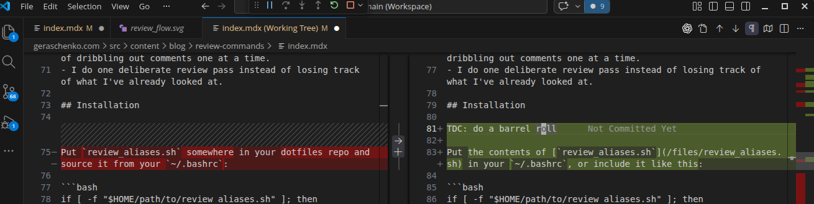

I've been using two little shell functions to help me work with AI coding assistants: `review_start` and `review_done`.

They let me do a full review pass in my editor, leave inline comments and fixes, and then hand the agent a commit containing only my feedback.

## TL;DR
Add `review_start` and `review_done` to your `~/.bashrc` (see Installation below), then use this workflow:

```bash
review_start "implemented XYZ"
# Review in your editor, making whatever changes you like
review_done
# Tell the agent to run `git show HEAD`. It will see just *your* changes.
```

## The idea

`review_start "implemented XYZ"` does the following things:

1. commits the agent-generated changes on your current branch,
2. creates a temporary review branch,
3. resets that branch back one commit while keeping the changes in your working tree.

So the agent's work is persisted as a commit, but in your editor it still looks like ordinary uncommitted changes.

The resulting history is roughly:

```text
A ── B ── C ── D  (my-feature)
          │
          └───  (${USER}/review_in_progress working tree contains changes from D)
```

Here `D` is the snapshot commit. The review branch points at `C`, but your working tree still contains the diff from `D`, so you can review it naturally in your IDE (Ctrl+Shift+G in VSCode).

While reviewing, I often:

- edit code directly,
- leave inline temporary comments like `TDC: factor this out into a helper`,
- ask questions like `TDC: why did you do X here?`



When I'm done, I run:

```bash
review_done
```

That switches back to the original branch, deletes the temporary review branch, and creates a new commit containing only my review edits and comments:

```text
A ── B ── C ── D ── E   (my-feature)
```

Now `E` is a precise “please address this review” commit. I can just tell the agent:

```bash
git show HEAD
```

and it can see exactly what I changed, without guessing and without clobbering my edits.

## Why I like this

The big win is that it turns “please address my review comments” into a concrete Git object.

- My requests are right next to the code I was looking at when I made the request.
- The agent can see what I already changed, so it is less likely to revert my manual fixes.
- It is token-efficient: I can hand over one commit instead of dribbling out comments one at a time.
- I do one deliberate review pass instead of losing track of what I've already looked at.

## Installation

Put the contents of [`review_aliases.sh`](/files/review_aliases.sh) in your `~/.bashrc`, or include it like this:

```bash
if [ -f "$HOME/path/to/review_aliases.sh" ]; then
  . "$HOME/path/to/review_aliases.sh"
fi
```

Then reload your shell:

```bash
source ~/.bashrc
```

## Caveats

A few important details:

- The current version uses `git commit -am ...`, so it handles tracked modified/deleted files but not new untracked files. If the agent created new files, `git add` them first.
- Only one review session can be active per repo.
- `review_done` expects you to still be on the review branch.
